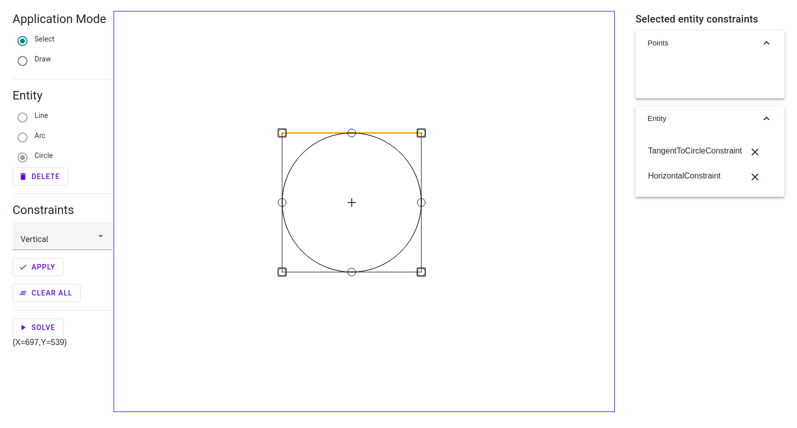

# NeoGeoSolver



This project provdes a geometric constraint solver for CAD systems
as a set of reusable C# components.

## Prerequisites
* .NET 7

## Getting started
```bash
$ git clone https://github.com/TrevorDArcyEvans/NeoGeoSolver.NET.git
$ cd NeoGeoSolver.NET
$ dotnet restore
$ dotnet build
$ dotnet test
```

## Supported constraints
* arc circle concentric
* arcs concentric
* arc radius
* arcs equal radius
* arc circle equal radius
* points coincident
* points distance
* points horizontal
* points vertical
* point on arc
* point on circle
* point to line distance
* circles concentric
* circle diameter
* circles equal diameter
* lines collinear
* line length
* lines equal length
* line tangent to arc
* line tangent to circle
* angle (between two lines)
* line horizontal
* line vertical
* lines parallel
* lines perpendicular
* equal value (might be useful?)

## Unsupported constraints
* point to point vertical distance
* point to point horizontal distance
* point to line vertical distance
* point to line horizontal distance

## Further work
* ~~change arc definition to centre-radius-start_angle-end_angle~~
* implement unsupported constraints
* ~~remove unused constraints~~
  * ~~tangent (use line-entity distance with zero distance)~~
  * ~~point on (use point-entity distance with zero distance)~~
  * ~~points angle~~
* ~~remove unused entities~~
  * ~~function (no docs + not normally used in CAD)~~
  * ~~spline (no docs + not normally used in CAD)~~
  * ~~ellipse + ellipsearc (not normally used in CAD)~~
* ~~more unit tests for solver~~
  * ~~multiple constraints~~
* portable UI aka test harness

## Further information
* [Geometric constraint solving - Wikipedia](https://en.wikipedia.org/wiki/Geometric_constraint_solving)
* [Sketchpad](https://en.wikipedia.org/wiki/Sketchpad)
* [A Geometric Constraint Solver](https://core.ac.uk/download/pdf/4971979.pdf)
* [Modelling of Geometric Constraints in CAD-Applications](https://userpages.uni-koblenz.de/~ros/ModellingGeometricConstraints.pdf)
* [Interactive 2D Constraint-Based Geometric Construction System](http://papers.cumincad.org/data/works/att/41d4.content.pdf)
* [Geometric Sketch Constraint Solving with User Feedback](https://acdl.mit.edu/ESP/Publications/AIAApaper2013-0702.pdf)
* [OpenCSM: An Open-Source Constructive Solid Modeler for MDAO](https://acdl.mit.edu/esp/Publications/AIAApaper2013-0701.pdf)
* [SolveSpace - parametric 3d CAD](https://solvespace.com/index.pl)
* [Geometric Constraint Solving](https://geosolver.sourceforge.net)
* [imuli/geosolver-python](https://github.com/imuli/geosolver-python)
* [SketchSolve.NET](https://github.com/TrevorDArcyEvans/SketchSolve.NET)

## Acknowledgements

This repository was forked from [BimCAD](https://github.com/BimCad-online/BimCADOnline) which
in turn was forked from [NoteCAD](https://github.com/NoteCAD/NoteCAD);
which I suspect was based on [geosolver-python](https://github.com/imuli/geosolver-python)
